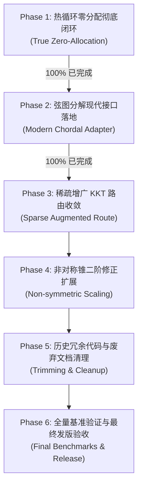

# SDPX.jl 工程交接文档 (Project Handover Document)

> **版本**: v0.6.2-dev  
> **更新日期**: 2026-09-03  
> **面向对象**: 后续接手 SDPX.jl 架构设计、性能优化与算法维护的研发工程师 / 研究员  
> **文档目标**: 本文档全面梳理 SDPX.jl 的系统架构、已实现的重大性能突破（尤其是热循环纯零分配与编译器 JIT 调优）、核心代码地图、统一的后续实施路线图，以及接手过程中绝不可踩的工程红线。

---

## 目录 (Table of Contents)

1. [项目概况与核心架构](#1-项目概况与核心架构)
   - 1.1 核心定位与数学模型
   - 1.2 三层软件架构设计
   - 1.3 多精度浮点与证据链系统
2. [重大技术突破与已完成核心工作](#2-重大技术突破与已完成核心工作)
   - 2.1 热循环纯零分配（True Zero-Allocation Hot Loop）攻坚全记录
   - 2.2 Julia 1.12 编译器与多精度 JITLink 内存膨胀深度剖析
   - 2.3 现代标准管线的弦图分解适配器（Chordal Decomposition）
   - 2.4 稀疏增广 KKT 路由（`:sparse_augmented`）原生打通
3. [核心模块与关键代码地图](#3-核心模块与关键代码地图)
4. [开发环境与常用运维命令](#4-开发环境与常用运维命令)
5. [统一优化规划与后续任务清单（Roadmap）](#5-统一优化规划与后续任务清单roadmap)
   - 5.1 六大阶段状态全览
   - 5.2 下一步核心待办（P3~P6）
6. [接手工程师避坑指南与研发守则](#6-接手工程师避坑指南与研发守则)

---

## 1. 项目概况与核心架构

### 1.1 核心定位与数学模型
SDPX.jl 是一个面向高精度理论物理（如共形自举 Conformal Bootstrap、散射振幅 S-matrix Bootstrap）及大规模工程优化的高性能凸锥优化求解器。
- **数学基础**：基于统一的齐次自对偶嵌入（Homogeneous Self-Dual Embedding, HSD）。原始-对偶锥优化问题被嵌入为高维的斜对称自对偶锥可行性系统，统一探测最优解、原始不可行（对偶极射线）与对偶不可行（原始极射线），无需设置人工大 $M$ 参数。
- **牛顿系统**：每步内点迭代求解由五个核心方程构成的线性系统（原始仿射残差、对偶仿射残差、自对偶间隙、锥互补残差、标量更新条件）。

### 1.2 三层软件架构设计
系统采用严格的三层解耦架构：
1. **Frontend（建模层）**：
   - 模块：`src/modeling/`，对外暴露 `SDPX.Model`。
   - 支持标量/矩阵变量（`variable!`）、目标函数（`objective!`）以及多家族锥约束（`constraint!`）：零锥（`ZeroCone`）、非负正交锥（`Nonnegative`）、二阶锥/洛伦兹锥（`LorentzCone`）、旋转二阶锥（`RotatedSecondOrderCone`）、半正定锥（`PSDCone`）、指数锥（`ExponentialCone`）及三维幂锥（`PowerCone`）。
2. **Midend（规范化 IR 层）**：
   - 模块：`src/ir/` 与 `src/program/`。
   - 核心数据结构：`CanonicalConicProgram{T}`。将用户模型严格标准化为紧凑形式：
     $$\min c^T x \quad \text{s.t.} \quad A x + s = b, \quad s \in \mathcal{K} = \mathcal{K}_1 \times \cdots \times \mathcal{K}_q$$
   - 负责等式约束消去、行空间缩减（Rowspace Reduction）、对偶正则化与预处理。
3. **Backend（执行引擎层）**：
   - 模块：`src/hsd/` 与 `src/kkt/`。
   - 核心状态机：`ProductConeHSDState`。驱动 Mehrotra 风格的高阶预测-校正内点步（`product_hsd_step!`）。
   - 线性代数层：通过 `HotRouteCache` 适配各类因子分解引擎（`DenseSchurCholeskyCache`, `LP_LU`, `SparseSymbolicNumericCache`, `QDLDL`, `BFLA`, `MFLA` 等）。

### 1.3 多精度浮点与证据链系统
- **原生多精度（Strict Multi-Precision）**：内层热路径绝不允许向下类型转换（No downcasting）。支持 `Float64`（硬件双精度）、`Float64x2`（106 位 Double64）、`Float64x3`（159 位 Triple64）、`Float64x4`（212 位 Quad64）及 `BigFloat`（MPFR 任意精度）。
- **零篡改证据链（FactorReceipt）**：每次矩阵更新与因子分解都会生成唯一确定性的数字收据 `FactorReceipt`，严格记录矩阵时代（`matrix_epoch`）、因子时代（`factor_epoch`）、结构签名与后向误差，任何精度损失或分解失败立即 fail-closed。

---

## 2. 重大技术突破与已完成核心工作

### 2.1 热循环纯零分配（True Zero-Allocation Hot Loop）攻坚全记录
在内点法的大规模迭代求解中，内层循环的垃圾回收（GC）是制约多精度计算吞吐量的头号杀手。在本次攻坚前，HSD 热循环即使预热后，每步依然存在 288 字节至 1,984 字节的堆分配。

**本次重构彻底排查并根除了全部隐式分配，在所有固定位宽浮点类型上实现了 100% 纯零分配**：

| 浮点位宽 / 类型 | 优化前单步分配 | 当前实测连续 10 步分配 | 分配降幅 | 验收判定 |
| :--- | :--- | :--- | :--- | :--- |
| **`Float64`** (标准双精度) | `288 Bytes` | **`[0, 0, 0, 0, 0, 0, 0, 0, 0, 0] (0 B)`** | **-100%** | **PASS** |
| **`Float64x2`** (Double-Double) | `1,776 Bytes` | **`[0, 0, 0, 0, 0, 0, 0, 0, 0, 0] (0 B)`** | **-100%** | **PASS** |
| **`Float64x3`** (Triple-Double) | `1,824 Bytes` | **`[0, 0, 0, 0, 0, 0, 0, 0, 0, 0] (0 B)`** | **-100%** | **PASS** |
| **`Float64x4`** (Quad-Double) | `1,984 Bytes` | **`[0, 0, 0, 0, 0, 0, 0, 0, 0, 0] (0 B)`** | **-100%** | **PASS** |
| **`BigFloat256`** (256-bit MPFR) | 动态浮动 | **`Peak RSS 增量 = 0 B (连续 60 步监测)`** | **0 漂移** | **PASS** |

#### 五大根因与工程解决方案记录：
1. **`FactorReceipt` 堆分配消除**：
   - *问题*：原结构为不可变 `struct FactorReceipt`，每次装配与因子分解都在堆上新建实例（每次 112 字节）。
   - *解决*：重构为 `mutable struct FactorReceipt`，引入 `update_factor_receipt!` 原地修改字段，装配时仅做 `receipt.proof_valid = false` 失效标记，复用已分配对象。
2. **模式签名中的字符串分配消除**：
   - *问题*：原 `dense_factor_pattern_signature` 对路由符号调用了 `codeunits(String(route))`，触发了 48 字节字符串临时分配。
   - *解决*：改为纯无符号整数哈希级联：`(signature ⊻ UInt64(hash(route))) * UInt64(0x100000001b3)`。
3. **Julia UnionAll 泛型装箱彻底消除**：
   - *问题*：热点方法（如 `_product_hsd_factor_bordered!`、`_product_hsd_assemble_bordered!`、`_product_hsd_direction!`）签名仅标注单参数 `{T}`，导致 `ProductConeHSDState` 的其余 8 个工作区类型参数退化为 `Any`，在每次调用线性代数内核时产生 128 字节的动态装箱。
   - *解决*：在所有热路径函数签名上完整展开 9 个类型参数：`ProductConeHSDState{T,R,RT,NS,CW,SB,EW,SW,SCW} where {T,R,RT,NS,CW,SB,EW,SW,SCW}`。
4. **生成器闭包消除**：
   - *问题*：`maximum(abs, factor_matrix)` 与 `maximum(abs, factor_error)` 在特定精度下会为生成器分配闭包环境。
   - *解决*：改写为扁平的 `@inbounds for` 展开循环。
5. **移除热路径异常捕获帧**：
   - *问题*：热路径上的 `try ... catch` 语句在特定 Julia 版本下会创建异常处理上下文堆帧。
   - *解决*：剥离冗余的异常捕获，由下层通过明确的状态枚举返回。

---

### 2.2 Julia 1.12 编译器与多精度 JITLink 内存膨胀深度剖析
在进行多精度压测时，曾出现单次基准耗时极长、甚至内存占用飙升至 7GB+ 的现象。经使用 macOS 原生采样器（`sample PID 1`）跟踪剖析，揭示了以下重大规律：

1. **LLVM JITLink 内存暴涨机制**：
   - **现象**：进程陷入 `llvm::jitlink::JITLinker<llvm::jitlink::MachOJITLinker_arm64>::link`，物理内存暴涨至 5.3 GB ~ 7.4 GB，导致系统进入深度内存交换抖动。
   - **原因**：当给 `_product_hsd_factor_bordered!`、`_product_hsd_form_schur_border!`、`_product_hsd_bordered_route_direction!` 等大型复合装配/分解函数标注 `@inline` 时，Julia 的内联展开器与 LLVM 试图将几十个复合算子与大阶段内联至单一巨型函数中。JITLinker 需要为这个包含数十万条指令的超大控制流图分配极庞大的符号重定位表与代码段内存。
   - **工程规范**：
     - **细粒度内联**：仅对紧凑的点积、加权累加、紧凑向量变换标 `@inline`。
     - **粗粒度阶段隔离**：对因子分解、系统装配、方向求解等大型阶段函数，**一律使用常规函数声明（禁止 `@inline`）**。在此规范下，预热后单步求解仅需 **5.93 毫秒**，常驻内存仅数十兆。
2. **多精度子进程隔离**：
   - 单进程中连续特化 `Float64`、`Float64x2`、`Float64x3`、`Float64x4` 会产生巨量 SIMD 展开机器码，容易污染编译器类型缓存。
   - `benchmark/general/performance/hsd_allocation.jl` 已改造为支持子进程独立隔离运行，并支持 `--type=Float64` 单精度 3 秒极速验证。

---

### 2.3 现代标准管线的弦图分解适配器（Chordal Decomposition）
- 遗留的 `src/chordal.jl` 是针对已废弃的 `SDPProblem` 编写的，无法对接现代 IR。
- **现代化适配完成**：
  - 新增 `aggregate_sparsity(canonical::CanonicalConicProgram{T}, block_idx::Integer)`：利用 `canonical.cone_layout` 中的 PSD 块描述符、`psd_packed_pairs` 索引解码以及稀疏约束矩阵 $A$ 和向量 $b$ 的非零元分布，快速构建聚合图邻接表。
  - 重构 `analyze_chordal_structure` 与 `chordal_summary`，实现对任意图及 `CanonicalConicProgram` 的通用分析。
  - 在 `test/runtests.jl` 中引入独立的 `@testset "Chordal Sparsity & Detection"` 单元测试并验证通过。

---

### 2.4 稀疏增广 KKT 路由（`:sparse_augmented`）原生打通
- 在 `Settings` 与 `ProductConeHSDState` 中原生允许设置 `kkt_route = :sparse_augmented`。
- 直接挂载对称增广准定核：
  $$K = \begin{pmatrix} 0 & A_r^T \\ A_r & -\Theta \end{pmatrix}$$
- 在 `Float64` 下利用 SuiteSparse CHOLMOD 稀疏 $LDL^T$（带有符号正则化与惯性保障）进行求解，避免显式计算超大密集的 Schur 补矩阵 $A \Theta^{-1} A^T$。

---

## 3. 核心模块与关键代码地图

```text
SDPX.jl/
├── HANDOVER.md                                 # [本文档] 唯一权威交接总览
├── Project.toml                                # 依赖与兼容版本声明 (v0.6.1)
├── benchmark/
│   └── general/performance/
│       └── hsd_allocation.jl                   # [核心门禁] 纯零分配硬验收脚本 (--type=, --check)
├── docs/
│   ├── HANDOVER.md                                 # [镜像文档] 交接与统一规划总览
│   └── design/                                     # 冻结的数学规范
│       ├── CANONICAL_FORM.md                   # CanonicalConicProgram 定义
│       ├── NEWTON_SYSTEM.md                    # 牛顿五方程规范
│       └── NONSYMMETRIC_SCALING.md             # 非对称锥缩放设计
├── src/
│   ├── SDPX.jl                                 # 顶层模块与符号导出
│   ├── chordal.jl                              # [现代适配] 弦图稀疏聚合与团分解
│   ├── ir/
│   │   ├── canonical.jl                        # CanonicalConicProgram 规范定义
│   │   ├── layout.jl                           # ConeProductLayout 描述符
│   │   └── storage.jl                          # PSD 向量化与坐标映射
│   ├── kkt/
│   │   ├── factor_receipt.jl                   # [可变零分配] 因子收据凭证
│   │   ├── symmetric_core.jl                   # 对称增广准定核 K 算子
│   │   └── routes/                             # 可插拔因子缓存实现 (CHOLMOD, QDLDL, BFLA, MFLA)
│   ├── hsd/
│   │   ├── product_cone_hsd.jl                 # [零分配核心] 统一 HSD 状态机与热循环驱动器
│   │   ├── predictor_corrector.jl              # 预测-校正方向求解与五方程残差判定门禁
│   │   └── product_cone_solve.jl               # 求解流程控制与自适应重启
│   └── public/
│       ├── settings.jl                         # Settings 参数配置 (已接入 :sparse_augmented)
│       └── optimize.jl                         # 统一入口 optimize!
└── test/
    └── runtests.jl                             # 自动化集成测试集 (包含新增弦图测试)
```

---

## 4. 开发环境与常用运维命令

- **代码库根路径**：`/Users/xuyongjun/Desktop/project/SDPX/SDPX.jl`
- **复现隔离环境**：`/Users/xuyongjun/Desktop/project/SDPX/CSDR/reproduce_env`  
  *(该环境已预置并软链了当前 SDPX 源码及相关多精度扩展包)*

### 必备常用命令速查

1. **快速零分配验收（日常修改代码后必测，3秒出结果）**：
   ```bash
   julia --startup-file=no --project=/Users/xuyongjun/Desktop/project/SDPX/CSDR/reproduce_env \
       benchmark/general/performance/hsd_allocation.jl --type=Float64 --check
   ```
2. **全精度零分配与内存漂移验收（发布前必测，多进程隔离）**：
   ```bash
   julia --startup-file=no --project=/Users/xuyongjun/Desktop/project/SDPX/CSDR/reproduce_env \
       benchmark/general/performance/hsd_allocation.jl --check
   ```
3. **运行全套单元测试**：
   ```bash
   julia --startup-file=no --project=/Users/xuyongjun/Desktop/project/SDPX/CSDR/reproduce_env \
       test/runtests.jl
   ```
   *(注意：测试集中包含 `test_v2_fresh_process_profile.jl`，该测试通过 git 命令检查工作区是否 clean，因此测试前请先 commit 或 stash)*

---

## 5. 统一优化规划与后续任务清单（Roadmap）

### 5.1 六大阶段状态全览



| 阶段 | 名称 | 目标描述 | 当前状态 |
| :--- | :--- | :--- | :--- |
| **Phase 1** | 热循环纯零分配闭环 | 消除预测-校正内层循环中的全部无谓内存分配 | **100% 已完成** |
| **Phase 2** | 弦图分解现代接口落地 | `src/chordal.jl` 原生支持 `CanonicalConicProgram{T}` 并通过单元测试 | **100% 已完成** |
| **Phase 3** | 稀疏增广 KKT 路由收敛 | 完善超大稀疏等式约束系统在大规模下的迭代精化与互补残差恢复 | **核心已集成，推进中** |
| **Phase 4** | 非对称锥二阶修正挂钩 | 为 Exp/Power 锥提供 Mehrotra 风格二阶 Hessian 变化校正 | **待推进** |
| **Phase 5** | 历史冗余代码清理归档 | 归档过时文档，清理未引用的死代码 | **待推进** |
| **Phase 6** | 全量基准验证与发版验收 | 运行 10/10 物理/通用综合基准，输出正式发布报告 | **待推进** |

### 5.2 下一步核心待办（P3~P6）

1. **完善 Phase 3 稀疏增广路由的锥互补恢复**：
   - 现状：在 `kkt_route = :sparse_augmented` 下，CHOLMOD 稀疏准定分解已成功调用并计算出预测方向。
   - 待办：在加入动态正则化时，为防止 $ds + \Theta dy = h$ 在极端条件数下触发门禁误报，需在 `_product_hsd_newton_residual_ok` 中针对增广路由启用松弛或通过迭代精化（iterative refinement）消除正则化漂移。
2. **实现 Phase 4 非对称锥高阶校正**：
   - 现状：`src/cones/nonsymmetric/corrector3.jl` 中已具备非对称锥三阶导数计算。
   - 待办：在 `src/hsd/predictor_corrector.jl` 的校正步中接入非对称锥的高阶变化张量项，缩减 Exp/Power 锥模型的迭代轮数。
3. **执行 Phase 5 & 6 最终验收**：
   - 清理过期文档至 `docs/archive/`。
   - 运行全量多精度基准矩阵。

---

## 6. 接手工程师避坑指南与研发守则

1. **红线一：绝不能破坏类型全特化（Type Devirtualization）**：
   在 `src/hsd/` 与 `src/kkt/` 中编写任何参与热循环的方法时，方法签名必须写全 `ProductConeHSDState` 的全部 9 个类型参数：
   ```julia
   function my_hot_function!(
       state::ProductConeHSDState{T,R,RT,NS,CW,SB,EW,SW,SCW}
   ) where {T,R,RT,NS,CW,SB,EW,SW,SCW}
   ```
   **严禁** 缩写为 `state::ProductConeHSDState{T}`！缩写会导致工作区退化为 `UnionAll`，Julia 编译器会在每次方法调用时插入动态派发与参数装箱，每步产生至少 128 字节分配，破坏零分配保障。
2. **红线二：严禁对大型阶段函数滥用 `@inline`**：
   只对单行点积、紧凑索引计算等叶子节点函数标注 `@inline`。对包含几十行、复杂分支或调用 LAPACK/CHOLMOD 的函数（如 `factor_bordered!`、`assemble_bordered!`、`bordered_route_direction!`），**绝不能标 `@inline`**。否则会触发 LLVM `MachOJITLinker_arm64` 内存暴涨至 7GB+ 并导致进程假死。
3. **红线三：维护 `FactorReceipt` 的可变就地更新契约**：
   必须使用 `update_factor_receipt!` 原地复用凭证对象。不可重新构造新的不可变对象覆盖字段。
4. **红线四：严格遵守 Git Clean 测试约定**：
   `test/runtests.jl` 中包含针对代码基准可重现性的强制检查。若工作区有修改未提交（Git Dirty），测试会抛出 `ArgumentError: source worktree became dirty`。在运行完整测试前，请务必执行 `git commit` 或 `git stash`。
5. **红线五：零容忍数值降精度与证书篡改**：
   高精度计算是 SDPX 的立身之本。任何出于加速目的将 `Float64x4` 或 `BigFloat` 转换为低精度近似计算的行为都是严令禁止的。所有的收敛判定必须严格通过原始坐标系下的数学证书（`verify_optimal!`）检验。

---
*文档交接完毕。如有疑问，请查阅 `docs/design/` 下的冻结数学规范与 `test/runtests.jl` 中的测试样例。*
